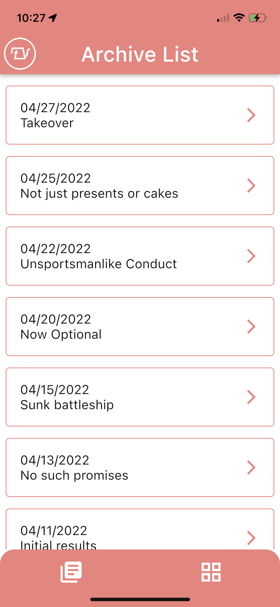
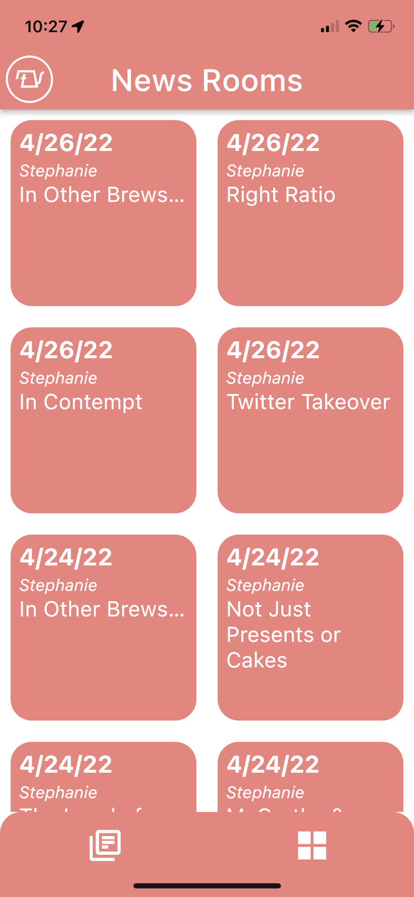
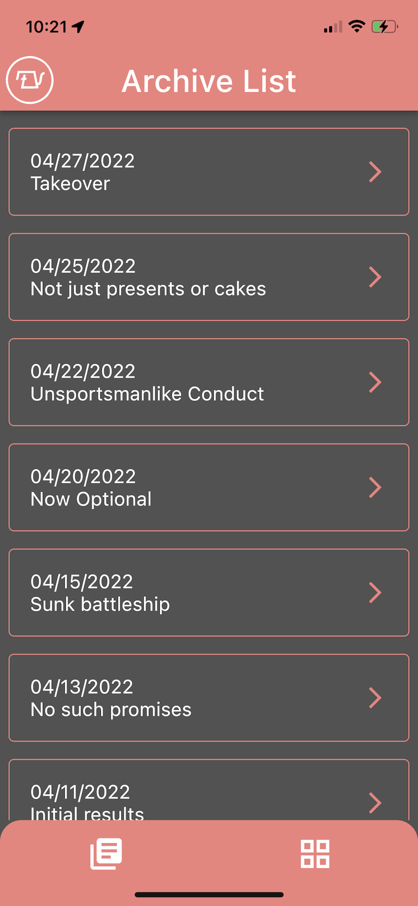
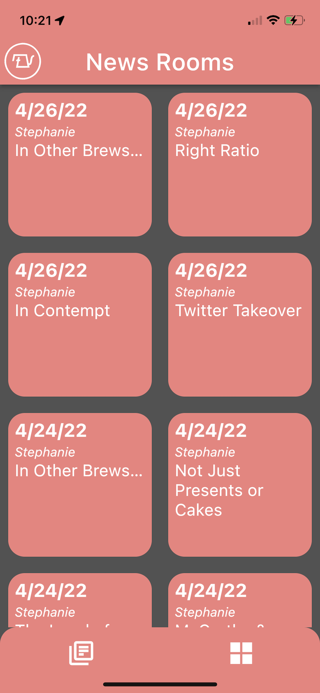

# The Pour Over App - in Flutter

This app is just a personal app that I use to keep up with The Pour Over news. This also helps me to look back on previous articles without having to sift through my email for them. Currently, the app has two pages:
1. The archive list which is the recent list of emails sent out to subscribers of The Pour Over.
2. the news room which is an extention of the /news page at [thepourover.org](https://www.thepourover.org/news). It provides a grid view similar to that of the website page.

The app features a light mode and a dark mode as shown below:

## Light Mode

## Dark Mode

As of right now the app will not be made publicly available on any app stores in hopes that The Pour Over would possibly aquire this from me at a later date. ;) If not, no biggy. I still get good use out of my personal apps.

The app essentially web scrapes The Pour Overs public web site pages for this information. It's not storing anything in any online database.

It works on both IOS and Android and I have other features I intend to add to it later. See the [FEATURES.md](https://github.com/lvstross/the-pour-over/blob/main/FEATURES.md) file.